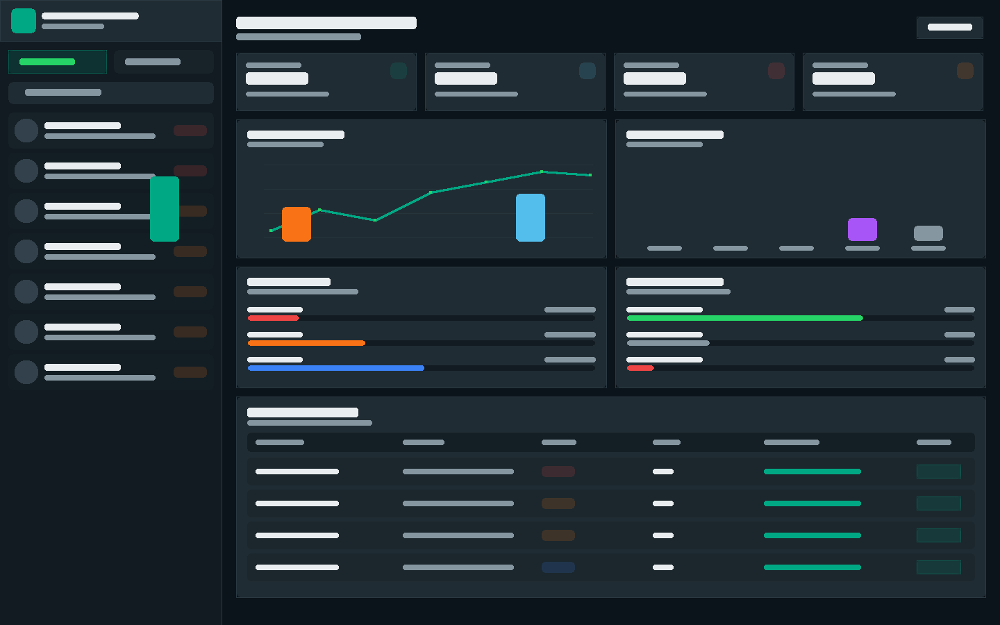
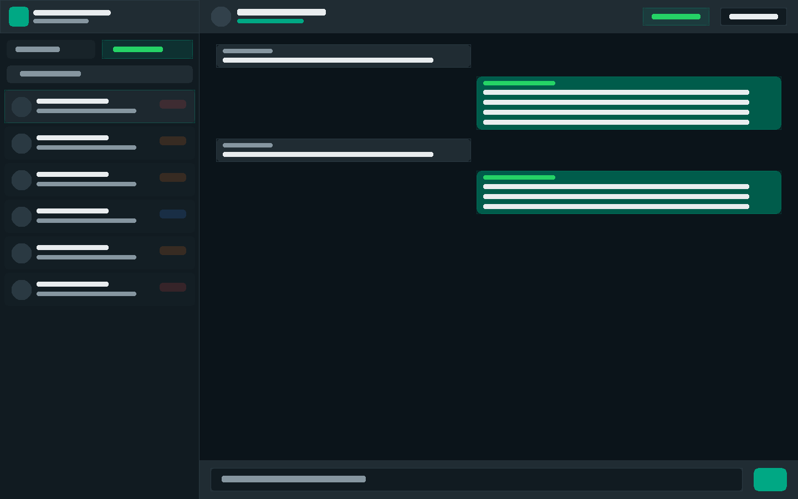
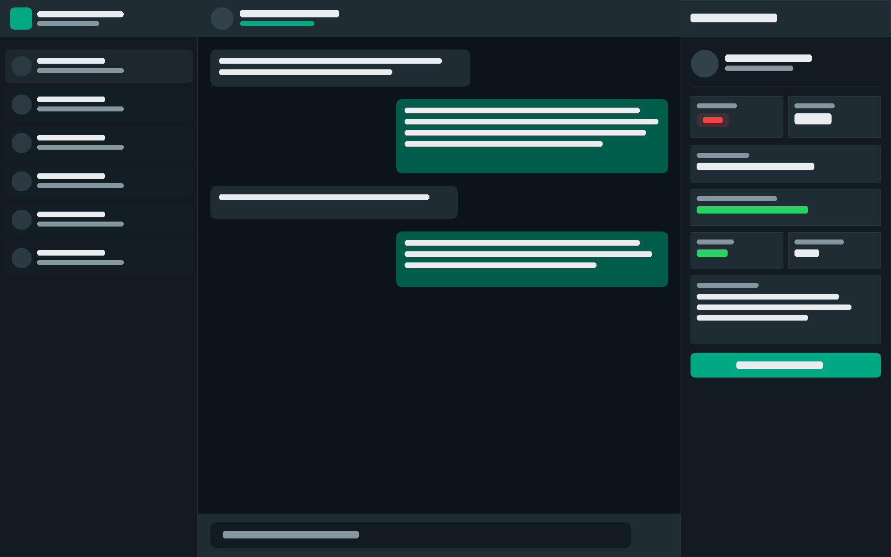

# 🤖 AI WhatsApp Assistant

> An AI-powered conversational assistant designed to help businesses manage customer queries through WhatsApp and other conversational channels.

## 👥 Team Name

**AI OPTIMUS**

---

# 📌 Problem Statement

Businesses receive a large number of customer queries through WhatsApp and other conversational channels. Customers frequently ask about products or services, pricing, availability, specifications, comparisons, offers, shipping, returns, warranties, payments, EMI options, and other business policies.

Traditional chatbots often struggle with real-world conversations involving follow-up questions, incomplete requests, informal language, typos, multilingual messages, product references, and changing customer requirements. This can lead to repetitive clarification, inaccurate responses, missed sales opportunities, poor customer experience, and increased workload for sales and support teams.

---

# 💡 Solution Overview

AI WhatsApp Assistant is a general-purpose AI-powered conversational sales and customer engagement assistant designed to understand and respond to real-world customer conversations.

The system uses conversational AI to understand natural, informal, multilingual, and multi-turn messages while maintaining conversation context. It can identify customer intent, understand follow-up questions, resolve references such as “the first one,” “the cheaper one,” or “is it available?”, and preserve customer requirements as conversations evolve.

The assistant retrieves relevant information from product or service catalogs and trusted business knowledge sources to provide grounded responses for queries related to pricing, availability, comparisons, offers, shipping, returns, warranty, EMI, payments, and other business policies.

The solution also includes safety and validation mechanisms to handle ambiguous requests, reduce incorrect responses, protect against manipulated instructions, and ensure that generated answers remain grounded in trusted business information.

By automating repetitive customer interactions, AI WhatsApp Assistant helps businesses provide faster and more consistent support while allowing human sales teams to focus on complex and high-value customer interactions.

<!-- Add solution architecture diagram here -->

## Screenshots

### Dashboard



### WhatsApp Chat



### Customer Intelligence



<!-- Add workflow / user journey images here -->

---

# 🔗 Live Demo

**Live Application:** https://wa.me/918871394934

---

# 🛠️ Tech Stack

### Frontend

* React
* Vite
* JavaScript

### Backend

* Node.js
* Express.js

### Database

* MongoDB
* MongoDB Atlas

### Artificial Intelligence

* Google Gemini
* Natural Language Understanding
* Conversational AI

### RAG and Knowledge Retrieval

* Business knowledge retrieval
* Grounded responses
* Product and service information retrieval

### Messaging

* WhatsApp Integration

### Authentication and APIs

* REST APIs
* Backend middleware

### Deployment

* GitHub
* Render

### Testing

* Node.js automated regression testing
* Adversarial testing
* Dialogue testing
* State-invariant testing
* Deployment-health testing

---

# ✨ Key Features

* 💬 Handles natural and informal customer conversations
* 🌐 Supports multilingual messages, Hinglish, transliteration, and typos
* 🧠 Maintains context across multi-turn conversations
* 🎯 Identifies customer intent
* 🔄 Understands follow-up questions and changing requirements
* 🔍 Resolves references to previously discussed products or services
* 💰 Handles pricing, availability, and comparison queries
* 📦 Retrieves product and service information
* 📚 Provides grounded answers using trusted business knowledge
* 🚚 Handles shipping, returns, warranty, EMI, and payment queries
* ❓ Detects ambiguous requests and asks for clarification
* 🛡️ Includes protection against prompt injection and manipulated instructions
* ✅ Validates responses against trusted business information
* 📊 Generates useful insights into customer intent and product interest

---

# 👨‍💻 Team Members

| Name                | Role                    |
| ------------------- | ----------------------- |
| **Aman Raghuwanshi** | AI & RAG Implementation (Team Leader)|
| **Yuvraj Raghuwanshi** | Frontend & Documentation |
| **Piyush Raghuwanshi** | Backend & Solution Architecture |
| **Devrath Raghuwanshi** | Database & Integrations |

---

# ⚙️ Setup Instructions

## Prerequisites

Make sure the following are installed:

* Node.js
* npm
* MongoDB or a MongoDB Atlas account
* Google Gemini API key
* Git

---

## 1. Clone the Repository

```bash
git clone https://github.com/optimus1911/AI_whatsaap_assistant.git
```

```bash
cd AI_whatsaap_assistant
```

---

## 2. Install Dependencies

Install the required dependencies for the project:

```bash
npm install
```

If the frontend and backend are maintained in separate folders, install dependencies inside each respective directory:

```bash
cd frontend
npm install
```

```bash
cd ../backend
npm install
```

---

## 3. Configure Environment Variables

Create a `.env` file in the appropriate backend directory and add the required environment variables:

```env
PORT=5000

MONGODB_URI=your_mongodb_connection_string

GEMINI_API_KEY=your_google_gemini_api_key

# Add WhatsApp credentials if required
WHATSAPP_API_TOKEN=your_whatsapp_api_token
WHATSAPP_PHONE_NUMBER_ID=your_phone_number_id
```

Do not commit your `.env` file or API keys to GitHub.

---

## 4. Start the Backend

```bash
npm run dev
```

Or, depending on the configured scripts:

```bash
npm start
```

The backend should start on the configured port.

---

## 5. Start the Frontend

Navigate to the frontend directory:

```bash
cd frontend
```

Run:

```bash
npm run dev
```

The Vite development server will provide a local URL, typically:

```text
http://localhost:5173
```

---

## 6. Configure WhatsApp Integration

Configure the WhatsApp API or webhook settings with the deployed backend URL.

The basic message flow is:

```text
Customer
   ↓
WhatsApp
   ↓
Webhook / Backend
   ↓
Conversation Intelligence
   ↓
Business Knowledge / Product Retrieval
   ↓
Google Gemini AI
   ↓
Response Validation
   ↓
Customer Response
```

---

# 🧪 Running Tests

Run the available automated test suites using the project's configured test commands.

Example:

```bash
npm test
```

The project includes testing for:

* Regression behavior
* Conversational flows
* Dialogue handling
* Adversarial inputs
* Conversation state invariants
* Deployment health

---

# 🚀 Deployment

The application can be deployed using:

* **Frontend:** Render or another static hosting platform
* **Backend:** Render
* **Database:** MongoDB Atlas

Make sure all required environment variables are configured in the deployment environment.

---

# 🎯 Project Vision

> **Turn everyday customer conversations into intelligent, personalized, and actionable business interactions.**

AI WhatsApp Assistant aims to make conversational sales and customer engagement faster, more intelligent, reliable, and scalable across different businesses, products, services, and industries.
